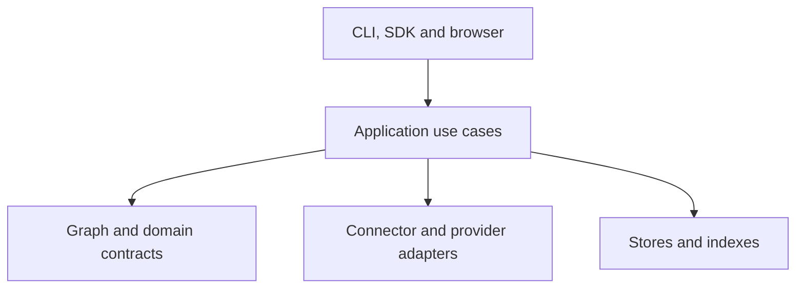

# Architecture and reviewed self-modification

TAREL builds persistent knowledge about information systems and compiles selected knowledge for a
harness. The TAREL Graph connects technical objects, semantic annotations, relationships, and
references. A workspace organizes independent source graphs.

The [CLI and Python SDK](cli-reference.md) and the browser share application use cases, stored state,
and review rules. The [contract reference](contracts.md) defines formats and invariants.

## Responsibilities

| Component | Responsibility |
| --- | --- |
| Connector | Observe catalogs, fields, keys, and supported bounded profiles/samples |
| Harness | Select tasks, operate authorized tools, execute analyses, assemble model context |
| Provider | Return structured annotation, lineage, or discovery proposals |
| TAREL core | Validate contracts, preserve identities/evidence, manage review, compile context |
| Store | Persist revisioned documents and rebuildable indexes |
| Browser | Explore existing knowledge and perform explicit review/edit actions |

TAREL does not execute analytical answer queries. Providers receive the requests prepared for them;
they do not acquire the harness's tool permissions. An execution result and an accepted semantic
claim are different records.

## Layers



Dependencies point inward. Domain code does not import the entry adapters. Adapters translate
inputs and outputs rather than implementing separate review or retrieval behavior. Importing
`tarel` is side-effect free; optional drivers and embedding runtimes load in their adapters.

## From source to knowledge

1. A connector or caller supplies a canonical catalog.
2. TAREL creates a technical graph with stable object and field identities.
3. A harness or provider proposes meanings and relationships with evidence.
4. Review accepts, defers, rejects, or requires reconsideration of claims.
5. Search selects anchors; compilation builds bounded graph context.
6. The harness uses that context and executes analysis through its own tools.

Observed metadata, proposed annotations, imported semantic models, and runtime observations retain
their separate origins and review semantics. Model success does not approve a proposal.

A graph represents one discovered source/catalog. Workspace systems own graphs; areas group schema
references. Zones are explicit, overlapping object sets inside one system. They do not duplicate
or own graphs. See [scope rules](contracts.md#workspaces-and-scopes).

Static lineage distinguishes job order, procedure calls, and physical reads/writes. Importers
supply report/model links; definition analysis supplies candidate data dependencies. A schedule
alone cannot establish the complete path from a report to source tables.

[Runtime lineage](contracts.md#runtime-lineage) separately records caller-reported execution,
including dependencies, hashes, and checks. It does not independently certify an answer or approve
a relationship.

## Contracts and extension points

| Contract | Purpose |
| --- | --- |
| [Connector](../src/tarel/connectors/contracts.py) | Typed catalog/probe/profile observations |
| [Provider](../src/tarel/providers/contracts.py) | Bounded structured-generation request/response |
| [Graph](../src/tarel/graph/contracts.py) | Technical and semantic records with stable identity |
| [Lineage input](../src/tarel/lineage/source.py) | Normalized definitions and observations |
| [Context](contracts.md#context-packets) | Facts, selection, budgets, and hashes |
| [Discovery](contracts.md#discovery-protocol) | Revisioned hypotheses, observations, and decisions |

A document format is not automatically a plugin interface. Connectors and providers have package
entry-point groups. Other integrations normalize external formats into supported input contracts.

## Self-modification through reviewed extensions

When an interface is missing, the harness can generate and implement an adapter against an existing
contract. The candidate stays inactive until reviewed and installed. This extends TAREL's reach
without changing the core to accommodate one source.

### Add a source connector

```bash
tarel connector scaffold example-source --output ./example-source
```

The scaffold creates `CONNECTOR_TASK.md`, an installable package skeleton, a connector manifest,
and reference files for dialect and metadata evidence. The package declares a `tarel.connectors`
entry point.

The harness implements `probe` first and `discover_catalog` next, returns the declared typed records,
and documents tested driver/product assumptions. Drivers stay optional. Test the adapter against a
private source and review both code and results before installing it into TAREL's environment:

```bash
python -m pip install ./example-source
tarel connector check example-source
tarel connector probe example-source --config config/example-source.toml
tarel graph build example-graph --connector example-source --config config/example-source.toml
```

The configuration follows the new adapter's documented format. Scaffold does not implement vendor
behavior, create credentials, or activate the package. Generated code must not alter kernel
contracts merely to pass validation.

### Use or add a provider

An endpoint compatible with an existing adapter needs configuration:

```bash
tarel provider configure internal-model \
  --adapter openai-compatible \
  --base-url "http://127.0.0.1:8000/v1" \
  --model "<served-model-ID>" --no-api-key
tarel provider test internal-model
```

This example assumes an unauthenticated loopback endpoint. Use the supported authentication method
when the endpoint requires credentials.

For a new protocol:

```bash
tarel provider scaffold example-provider --output ./example-provider
```

The harness implements `StructuredProvider.generate_structured`, checks valid and invalid responses,
timeouts and authentication errors, and reviews what data leaves the machine. After review,
installation exposes its `tarel.providers` entry point; a provider profile selects that adapter.

### Other imports

Knowledge commands attach documentation. Report, scheduler, semantic-model, and custom-script
metadata can be normalized into supported semantic/lineage inputs. A field accepting a language
name does not imply a built-in analyzer for every language. Use the versioned contract and record
unresolved dependencies explicitly.

## Persistence and revisions

The state root contains graph, workspace, lineage, discovery, and other domain documents. JSON
records are authoritative. Selective graph caches and retrieval indexes are rebuildable.

Domain stores publish atomic writes. Revision-bound operations reject stale input rather than
mixing graph states. Coordinate writers targeting one document; file-first storage is not a
distributed multi-writer database.

Schema drift can preserve knowledge while requiring review. Rebuild dependent indexes and context
when identities change. See [schema changes](contracts.md#schema-changes-and-stale-claims) and
[selective storage](contracts.md#graph-storage-and-selective-reads).

## Context and data boundaries

Context separates stable selected facts from dynamic questions, rankings, paths, and omissions.
A question-independent prefix can be reused while scope and revisions remain valid. Token limits,
message placement, cache headers, and cache lifetime belong to the harness/provider integration.

Raw sample rows are excluded from ordinary graph/context artifacts. Observation workfiles and
private entity/binding operations are separate data surfaces. Metadata-only context does not
restrict the harness's other tools; enforce source policy at the execution boundary.

[CLI and SDK](cli-reference.md) · [Contracts](contracts.md) · [Demo](retail-demo.md) ·
[Workshop](workshop.md)
