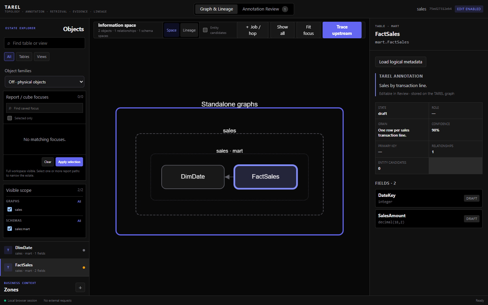
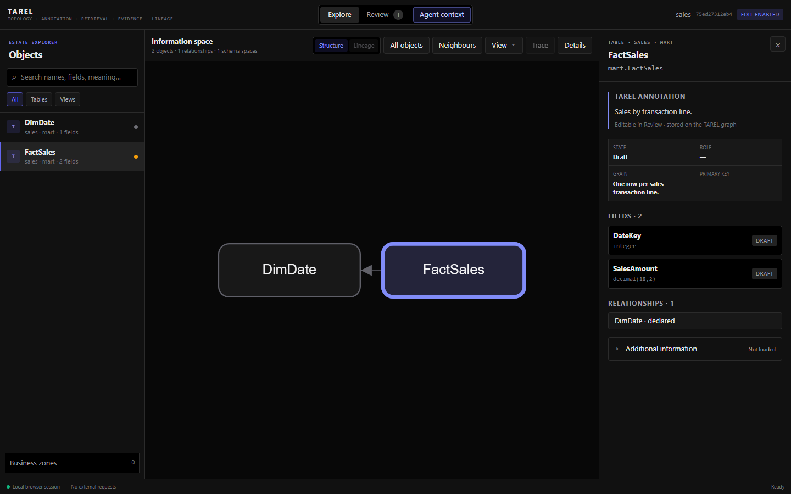
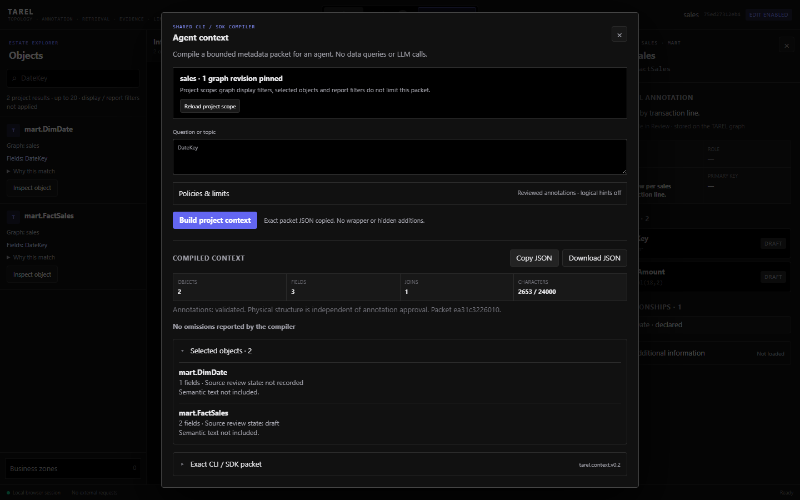
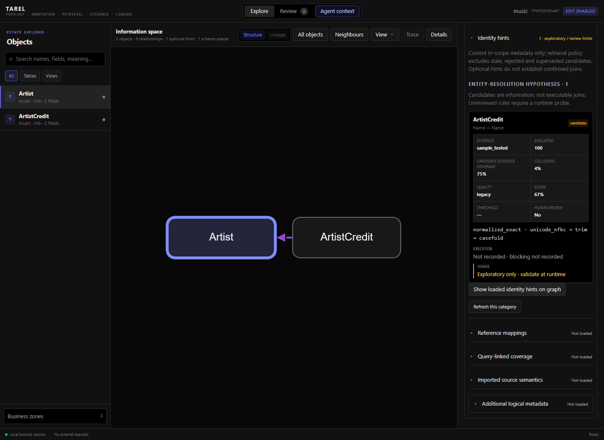
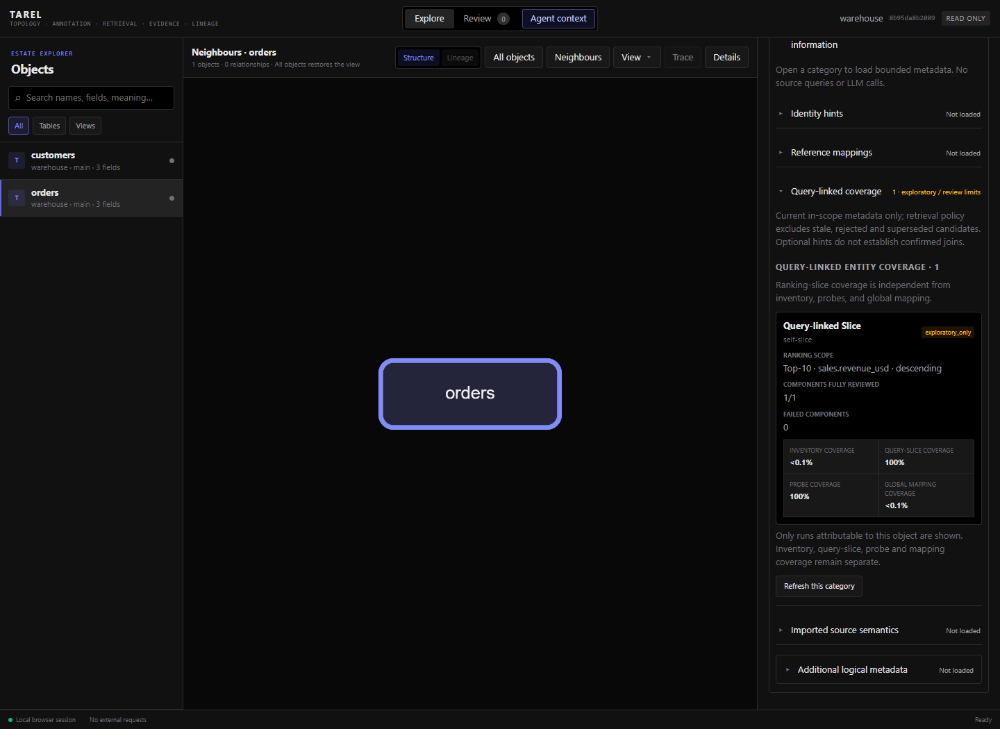
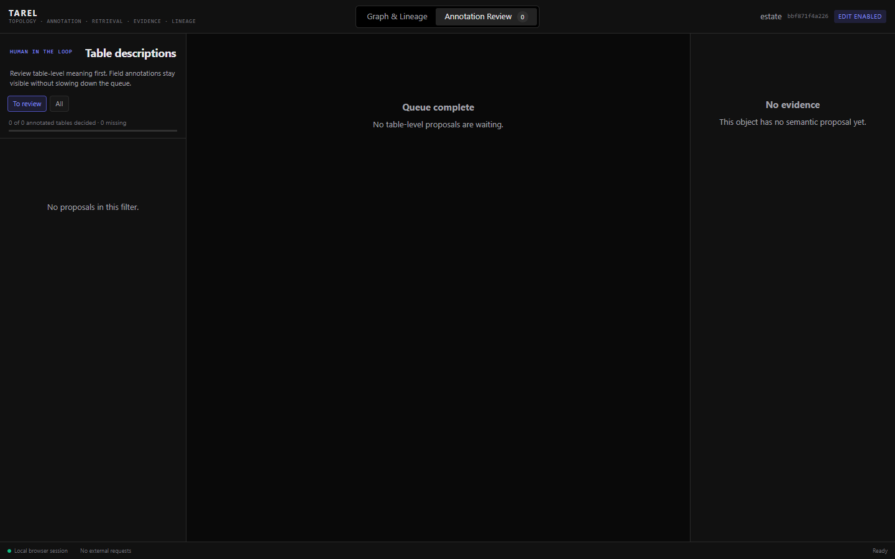
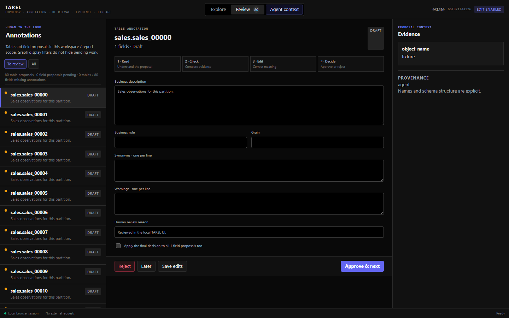
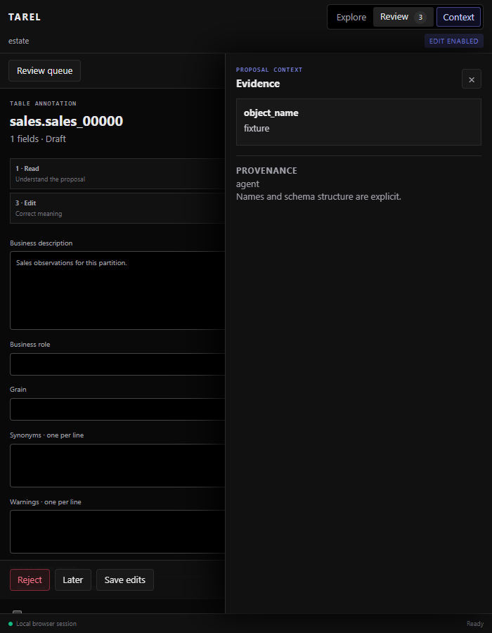

# Focused browser workflows

The local browser is a view over TAREL's existing metadata and review application paths, not an
analysis executor. Start it with `tarel ui GRAPH`; add `--edit` only when you intend to change
annotations or workspace metadata. No connector or LLM is invoked merely by opening an object.

## Explore first, details when needed

The object list and the selected object's meaning, fields, keys and review state are the primary
navigation. View settings, report filters and optional metadata are secondary disclosures rather
than permanent empty panels. Entity hypotheses, mappings and imported semantics retain their
uncertainty labels when collapsed; opening a card never approves a candidate.

On narrow windows, the object navigator and inspector can be opened and closed independently.
Review evidence remains reachable rather than disappearing at a responsive breakpoint.

## Review is independent of family layout

Collapsing physical tables into an object family changes the graph visualization, not the work
awaiting review. Review counts distinguish table proposals, field proposals and missing
annotations. A reviewed table with draft fields still has pending work.

Opening Review loads physical review records separately, within the launched graph/workspace
scope and any explicitly selected report filter. Visual graph collapse does not affect that
scope. A selective family bootstrap may deliberately defer counts to avoid hydrating all member
fields; an unknown count is not zero and is never displayed as a completed queue.

Review remains table-led. The existing explicit option can apply a table decision to its field
proposals; inspecting field details does not itself review them. Missing table proposals and
missing field proposals are not silently treated as rejected or approved.

## Project search and agent context

The browser's project search uses the same lexical search application path as `tarel search` and
`Tarel.search`. Field names and reviewed family names are searchable; a family hit remains a
metadata reference, not an executable table or an automatic expansion of its members.

Agent context is compiled by the existing CLI/SDK context use case. The preview's JSON is the
unchanged context packet, including stable/dynamic identities, budgets and visible omissions.
Copy and download act on that packet in the browser; the server does not save a query history or
write a new context artifact. There is no provider, embedding-model download or source query.

**Scope is the launched graph or configured workspace scope.** Report filters, selected graph
nodes, neighbourhoods and display filters are not additional context constraints. The dialog names
this boundary explicitly; it does not trim packets after compilation or invent an object-selection
contract. A workspace launch restriction cannot be overridden by the browser request.

The default preview uses reviewed annotations only. This filters semantic claims, not physical
tables. Optional logical hints are off by default and can be enabled for reviewed hints or explicit
exploratory hints. The ordinary context contract covers derived relations, reference mappings and
families; it does not resolve protected entity aliases or export all visible entity candidates.

Preview requests bind to a current scope/revision snapshot. Changed graphs or workspace definitions
produce a visible conflict and require refreshing the scope. Changing the question or options
invalidates the previous preview; copied or downloaded JSON is never silently reused for new inputs.

## Optional information is explicitly loaded

The default physical-object view loads topology and annotations, not the entity-candidate,
reference-mapping, query-linked coverage, semantic-import or logical-topology sidecars. Knowledge
documents are loaded when opening Review. Lineage explicitly requested at launch remains available.

An object's **Additional information** disclosure groups the advanced categories. Opening that group
does not query the categories. Open an individual category to load its bounded details. Before that,
the state is **Not loaded**, not zero candidates and not an implied approval. Errors are visible in
the requested category and can be retried; a damaged optional artifact need not block the ordinary
physical-object view.

Entity and reference-mapping details retain their existing evidence, review state and
`exploratory_only`/`confirmed` distinction. Loading or drawing a hint does not review it and does not
change retrieval policy. Coverage is separate: a run spanning other objects is not presented as
coverage of this table. Unattributable coverage is omitted explicitly rather than guessed.

The adapter checks the selected physical object and every referenced field against the server's
workspace/report scope. It returns at most 20 records per category, with omissions and a size limit,
and requires current graph and scope revisions. Imported semantics are limited to bindings for the
selected object or field, without exporting model-wide expressions or source files. Private entity
keys and alias values are not sent to the browser. Changing scope or reloading discards loaded hints;
use the explicit refresh action for later artifact changes.

**View → Derived relations** requests the existing logical-topology projection. **Object families**
remains an explicit alternative view, with member pages requested separately. These views explain
their evidence limits; neither executes derivations, unions or joins.

This is lazy GUI loading, not a new storage engine. An individual requested category can still scan
existing sidecar files, and the explicit family view retains its existing selective-load/full-view
fallback behavior. CLI/SDK contracts, persisted formats and the dependency set are unchanged.

## Visual walkthrough and validation

These are actual browser captures, not mockups. All objects, candidate evidence and coverage
numbers shown below are **synthetic test fixtures**. They are not MusicBrainz measurements or
claims about a production database. No database connector or provider was called for these GUI
checks, and no private rows, keys or source credentials were captured.

### 1. The ordinary object view

Before, family options, empty report filters and redundant source boxes preceded the object list.
After, the objects, their descriptions and fields have priority. In the same 1440 × 900 fixture,
the object list starts at approximately 204 px instead of 712 px. The single-schema graph no longer
needs three enclosing labels to explain two tables; multi-source grouping remains available.

Before:

After, with the same graph, selection and window size:

### 2. Search metadata, then compile an agent packet

Searching `DateKey` returns both tables with a matching field. A two-graph fixture returns four
hits, labels the owning graph and opens the correct same-named object. The context preview names
the project scope and revisions, exposes budgets and omissions, and keeps draft source review state
distinct from semantic text actually included in the packet.

The browser's copied JSON and downloaded JSON were parsed and compared with the returned packet;
both were exact. Adapter tests also compare the packet with CLI/SDK output. Editing a question or
policy invalidates the old preview. A changed graph or workspace scope is a conflict, not permission
to silently compile a different scope.

### 3. Additional information stays optional

Opening the parent disclosure makes no optional-detail request. Opening **Identity hints** makes
one bounded request for that category. The candidate can then be drawn explicitly; its evidence,
runtime-validation requirement and amber unreviewed badge remain visible. Reference mappings use
the same opt-in drawing control. Merely inspecting a candidate never promotes it.

Query-linked coverage is loaded separately and only for runs attributable to the selected object.
The fixture deliberately distinguishes a fully checked query slice from very small inventory and
global mapping coverage. Only the exact value `1.0` displays as `100%`; values just below it show
`<100%`, while small nonzero coverage shows `<0.1%` rather than a misleading zero.

### 4. Visual collapse does not complete review work

The synthetic estate has 80 physical table proposals. The old compact family view appeared to have
no pending review work. The updated Review loads all 80 physical records; applying the saved
three-member report scope yields exactly three. Neither family collapse nor display filters approve
annotations. Field-only proposals are covered by separate regressions.

Before:

After:

At 700 px width, object navigation, object details, the review queue and evidence remain reachable
through explicit controls. Escape closes the active drawer. A native context dialog does not close
unrelated background drawers when dismissed.

### Checks and honest limits

The complete suite passed **587 tests**, alongside Ruff and package-build checks. Focused tests
exercise token enforcement, read-only access, shared CLI/SDK output, full endpoint ownership,
workspace/report intersections, stale responses, corrupted optional artifacts, bounded payloads,
protected-value exclusion and coverage/status rendering. Real-browser checks covered the desktop,
1024 px and 700 px layouts, optional categories, derived toggles, family/report review, multi-graph
search, clipboard copying and download. The final browser scenarios reported no JavaScript errors.

This improves access to existing TAREL metadata; it is not an analytical chat, a new discovery
executor or a benchmark of database/LLM performance. Project context still does not inherit report
or canvas filters, and optional storage scans/family fallbacks have the limits described above.
