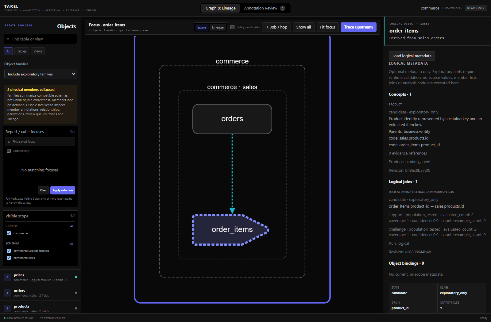
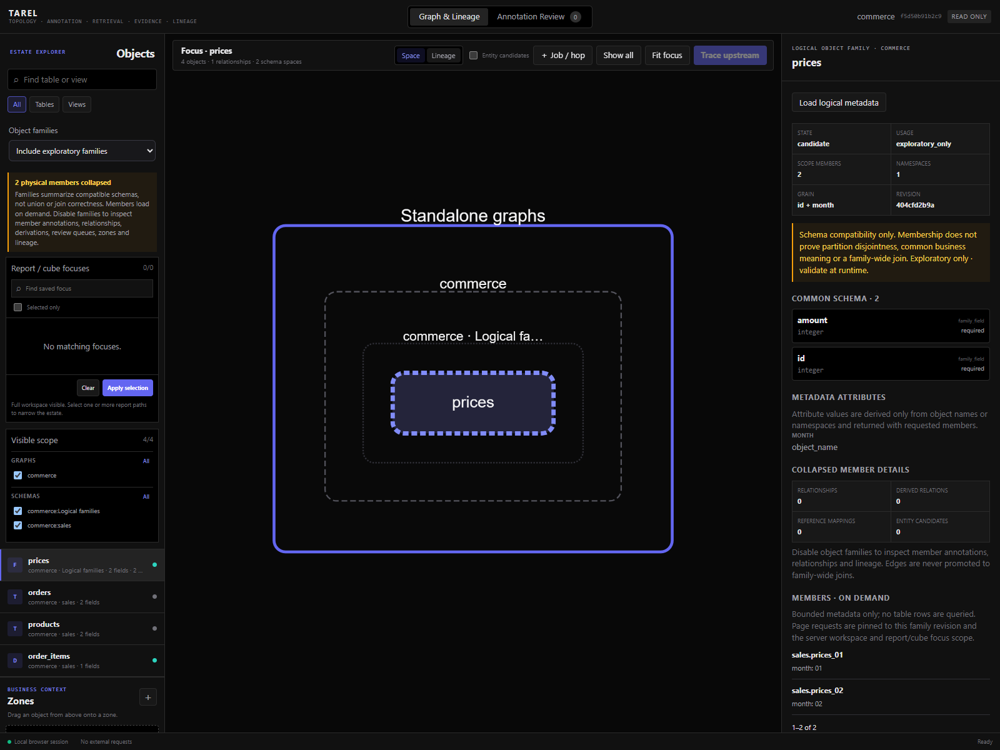
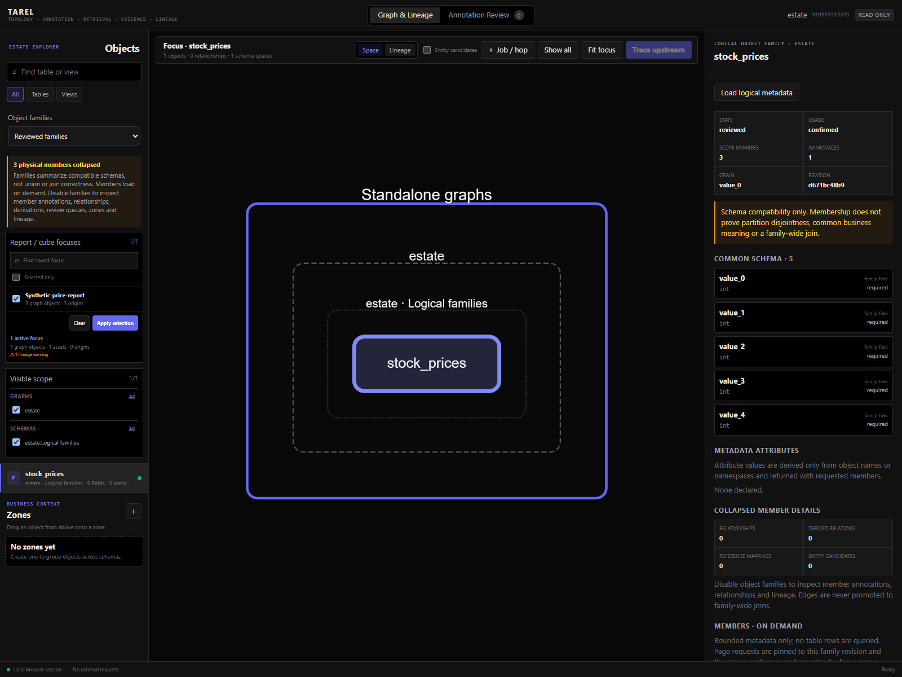

# Optional logical metadata: implementation and validation

TAREL remains a context compiler. These optional features add metadata, bounded retrieval and
provenance; they do not add a BI agent, database executor, ontology engine or automatic identity
resolution. All new contracts are experimental. CLI and SDK share application functions, and no
mandatory dependency was added. Public stability still requires maintainer contract review.

## What each feature contributes

| Feature | Practical use | Public entry point | Explicit boundary |
| --- | --- | --- | --- |
| Family-name search | Find `stock_prices` without knowing its physical members. | `tarel search market stock_prices`; `tarel.search.graph(...)` | Confirmed families by default; a logical hit is not an executable SQL table. |
| Internal LLM family proposals | Let the configured provider propose names, members, grain and metadata attributes. | `family plan`, `family run`, `family run-show`; `tarel.families.plan/run/load_run` | Exact schemas bound the batch; only the LLM decides membership. Suggestions remain candidates. |
| Selective GraphStore | Read a header, object page or selected schema without repeatedly parsing the complete graph. | `graph header/objects/slice/rebuild-index`; `tarel.graph.header/objects/slice` | JSON remains authoritative. Initial bootstrap is eager; warm supported paths are selective. |
| Families plus report/cube Focus | Show just the partitions used by the selected report. | `tarel ui estate --families confirmed_only --focus report`; `tarel.view.graph(..., focuses=(...))` | Focus/workspace intersection happens before compaction; a member's lineage never becomes a family-wide assertion. |
| Object-to-value binding | Resolve privately selected symbols to the relevant price-table members. | `binding import/find/resolve`; `tarel.bindings.import_document/find/resolve` | Exact string routing to declared family attributes only; no fuzzy rule or private mapping table. |
| Logical-endpoint Discovery | Probe an extracted item key against a product key in the existing AVO loop. | `discovery start joins --logical-endpoints`; `tarel.discovery.start(..., logical_endpoints=True)` | Harness execution supplies support and challenge; promotion creates a logical sidecar, not a physical foreign key. |
| Generic context expansion | Add a small metadata delta after a private query identifies what is needed next. | `context expand`; `tarel.context.expand(...)` | Revision-, scope-, policy- and budget-checked; private handles/values are not retained or echoed. |
| Concepts and hierarchies | Connect code/label representations and their declared parent concepts. | `concept import/find/review`; `tarel.concepts.import_document/find/review` | An acyclic metadata hierarchy does not establish value equality, a join or a valid rollup. |
| Logical-operation lineage | Trace physical reads through extraction, mapping, expansion and final analysis. | Existing `lineage import-runtime/trace-runtime`; `tarel.lineage.import_runtime/trace_runtime` | Optional runtime v0.3 records actual caller observations; it does not execute or automatically verify them. |

The read-only GUI inspector has an explicit **Load logical metadata** button for concepts,
logical joins and bindings. It displays current in-scope evidence, revisions and effective usage.
It neither submits private values nor automatically queries a source. Runtime v0.3 has a sanitized
browser projection helper and CLI trace; a new interactive runtime-lineage canvas is **not** part
of this slice.

## Executed checks and observations

The final combined regression run passed **500 tests**. Ruff, JavaScript syntax checks and the
public wheel/source-distribution audit passed as well. The built wheel was exercised independently
of the source tree for public SDK availability and CLI dispatch. Importing `tarel` still activates
neither SQL drivers nor the selective SQLite cache.

### Real local SQL Server: catalog-only family workflow

The existing SQL Server instance was reached directly, without Docker. The observed catalog
contained `Production.TransactionHistory` and `Production.TransactionHistoryArchive` in
AdventureWorks2025: two tables with nine fields each. No table rows or connection details were
read into TAREL artifacts; no source rows were created or modified.

The public SDK imported the observed `CatalogResult`, proposed a family with an `origin` metadata
attribute, found it by its logical name, returned a one-member page with a continuation, and
expanded it from a context packet without omissions. A subsequent selected-schema read hydrated
12 nodes and reported `full_document_read=false`.

The family remained `exploratory_only`. Catalog compatibility does not establish disjoint history
ranges, globally unique transaction IDs or safe aggregation. Those remain private harness checks.

### Live provider: proposals, not manufactured confidence

An explicitly invoked configured OpenRouter provider (`deepseek/deepseek-v4-flash`) received only
synthetic catalog metadata: ten objects, six schema-compatible eligible objects in one batch and
four objects omitted for lack of a compatible peer. It proposed two families: four sales/archive
tables and two tenant-event tables, with logical names and literal metadata attributes.

Both results were stored as `candidate` / schema-only declarations. The proposed sales grain did
not establish uniqueness across partitions. This is precisely why an LLM proposal is not promoted
to a confirmed union or join. This small live run demonstrates provider integration and a useful
suggestion, not general model quality or benchmark accuracy. Tests separately cover malformed and
incomplete responses, refusals, sanitized failures, model pinning, budgets, overlap and resumption.

### Real private SQLite harness: logical joins and lineage

An in-memory read-only SQLite harness actually exploded an order JSON array and joined its
extracted product IDs to a product table. Two extracted records matched; the unmatched probe
returned zero. The existing AVO flow accepted the measured support/challenge and promoted a
retrievable logical-join candidate. CLI and SDK returned the same metadata. Neither query text
nor private labels entered the stored artifact.

A separate runtime-lineage fixture exercised source reads, extraction/explosion, mapping and
final aggregation: three item rows reconciled to totals five and one. The resulting v0.3 trace
preserved the operation chain and old runtime contracts still round-tripped. A successful tiny
fixture does not assert population-wide join, mapping or entity correctness.

### Scale, privacy and review closure

- A 2,000-table cache fixture tests warm reads with full graph loading, full document parsing and
  `graph.json` reads deliberately forbidden. The compact family browser emits one family with no
  hidden field hydration and less than 13 KB of metadata. This is a payload assertion, not a
  latency benchmark or claim of zero metadata scanning.
- Family member paging and private binding resolution validate every member's schema. Warm
  binding expansion does not deserialize the complete graph. Corrupt caches and revision races
  fail visibly rather than serving old metadata as current.
- Scope tests cover workspace/namespace boundaries, report/cube intersections, stale page tokens,
  both sides of logical relationships and parent-concept dependencies. A private binding cannot
  resolve a member outside the authorized context scope.
- Candidate, rejected and stale dependencies cannot enter `confirmed_only`. Knowing an artifact
  ID does not bypass same-program review precedence. Imports cannot forge human approval.
- Expansion tests cover every target kind, missing handles, stale bases, oversized output,
  explicit partial results and private sentinels absent from JSON and public result representations.
- Concept tests include 1,100-level hierarchies, cycle rejection, revision drift and policy closure.
- Browser tests exercise safe text rendering and discard late responses after changing selection.
  Live browser checks reported no JavaScript page errors during metadata loading and Focus paging.

## Screenshots from the exercised GUI

All screenshots below show **synthetic metadata fixtures**, not source rows or the live SQL Server
catalog run. Evidence counts on the logical-join screenshot come from the small private SQLite
fixture above. The concept and derived-grain declarations remain exploratory.



The logical relation retains its ordinary source-to-derived edge. Additional semantics appear
in the inspector, with separate `exploratory_only` status, rather than as invented physical joins.





The report screen was exercised with an actual click on **Apply selection**, then **Load members**:
one logical family, three scoped members, and no outside member returned. This Focus path explicitly
reports `full_projection`; the no-Focus metadata-only estate path is the selective one.

## Reproduce the automated checks

```bash
python -m unittest discover -s tests
ruff check src tests
node --check src/tarel/ui/static/app.js
node --check src/tarel/ui/static/logical_metadata.js
python -m build --outdir /tmp/tarel-validation-dist
python tools/check_distribution.py /tmp/tarel-validation-dist
```

Use a fresh isolated build directory. The public tests need no live model, database credentials or
private benchmark data. Optional JavaScript tests report a skip when Node is absent. Live SQL
Server/provider observations described above are additional local checks, not CI requirements.

Detailed contracts and runnable SDK/CLI examples:
[families](object-families.md), [LLM proposals](family-proposals.md),
[selective storage](graph-storage.md), [Focus](family-focus.md),
[bindings](object-value-bindings.md), [logical Discovery](logical-join-discovery.md),
[context expansion](context-expansion.md), [concepts](semantic-concepts.md),
[runtime lineage](runtime-lineage.md).
